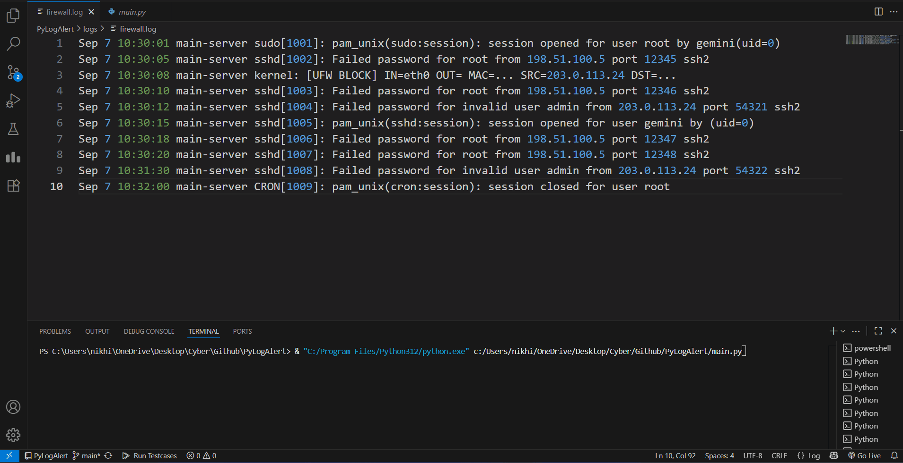

# PyLogAlert 🛡️

**PyLogAlert** is a lightweight, real-time log analysis and alerting engine written in Python.  
It monitors log files for suspicious patterns, parses them into a structured format, and sends **rich, interactive notifications** to Slack.

This project serves as a functional example of a **“Mini-SIEM”** focused on the core principles of **detection and notification**.

---

## ✨ Key Features

- 🔍 **Real-time Log Monitoring** – Processes log entries as soon as they’re written.
    
- 🧩 **Pattern-Based Detection** – Regex-powered parsing for syslog-style logs.
    
- 🏗️ **Modular Architecture** – Separation of concerns: _Collect → Parse → Analyze → Respond_.
    
- 📡 **Rich Slack Alerts** – Interactive notifications with buttons (e.g., “Check IP on VirusTotal”).
    
- 🔒 **Secure by Design** – API keys/webhooks stored in configs (excluded from Git).
    

---

## ⚙️ How It Works

Each log entry follows a simple but powerful pipeline:

**Collect → Parse → Analyze → Notify**

1. **Collect** – Tails a specified log file.
    
2. **Parse** – Converts raw log strings into structured dictionaries.
    
3. **Analyze** – Matches structured data against detection rules.
    
4. **Notify** – Executes a playbook and sends an alert to Slack.
    

---

## 🚀 Quick Start

### 1. Clone the repo

`git clone https://github.com/your-username/pylogalert.git cd pylogalert`

### 2. Install dependencies

`pip install -r requirements.txt`

### 3. Configure your settings

Update `config.json` with:

- Log file path
    
- Detection patterns
    
- Slack webhook URL
    

`{   "log_file": "/var/log/auth.log",   "patterns": [     "failed password",     "unauthorized access"   ],   "slack_webhook": "https://hooks.slack.com/services/XXXX/YYYY/ZZZZ" }`

### 4. Run PyLogAlert

`python pylogalert.py

---

## 🤝 Contributing

This project is open to contributions! 🚀  
If you find bugs, have ideas, or want to improve it:

- Open an **issue**
    
- Submit a **pull request**
    
- Suggest enhancements
    

> 💡 _Feel free to commit changes if you spot something useful — collaboration makes this better._
> ---
## Author

**Made with ❤️ by [Nikhil Mahala](https://github.com/nikhilmahala987)**

If you find this project helpful, don’t forget to ⭐ **star the repo**!